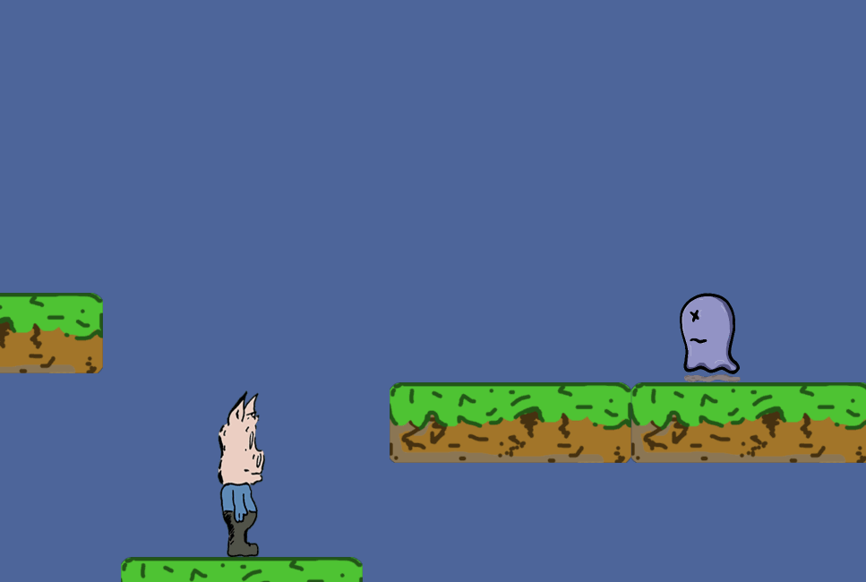

# Pigboy

Pigboy, our young pig of flanders, returns this time to the digital age.   

This sidescroller game follows the perilous adventures of the young swine known as pigboy.  

### Next Steps
- [X] Switch main game library to pyglet
- [x] Develop cleaner animation loop images
- [ ] Create platforms and enemy class
- [x] Allow for platform jumping and gravity 

### Testing it Out Yourself
Testing out the game is as easy as cloning this repository...
Outside of the python standard library the only required package
is `pyglet 1.4.6`.
Finally run `python start_pigboy.py`.
